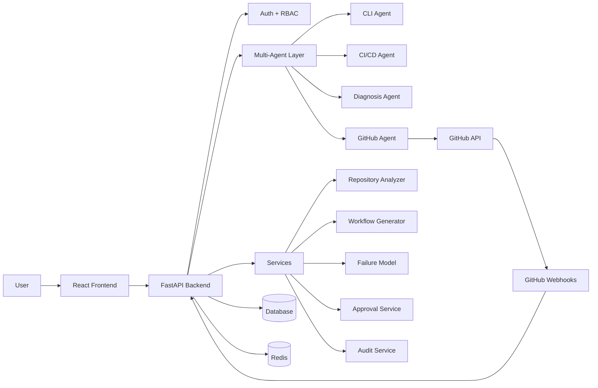

# Agentic AI-Powered Smart DevOps Assistant

Final-year project: **Agentic AI-Powered Smart DevOps Assistant for Autonomous Software Delivery and Infrastructure Management**.

This system is a web-based CI/CD automation assistant. It helps a user inspect a GitHub repository, detect its stack, generate a suitable GitHub Actions workflow, diagnose failed CI/CD logs with a trained ML model, recommend practical fixes, and create safe pull requests with audit logging and human approval controls.

The project is designed for a supervisor/demo workflow, not uncontrolled production automation.

## What The System Proves

The MVP proves an end-to-end CI/CD assistance loop:

1. A user authenticates through the web app.
2. The user scans a GitHub repository.
3. The backend detects stack, project layout, package managers, existing workflow files, and CI/CD readiness.
4. The system generates GitHub Actions YAML for the detected project type.
5. Workflow changes are proposed through a branch and pull request.
6. GitHub webhooks can capture failed workflow runs.
7. The backend downloads real GitHub Actions logs when credentials allow it.
8. A trained text classifier predicts the failure type.
9. A fix recommendation service suggests remediation.
10. Higher-risk actions are gated by human approval.
11. Agent actions, GitHub actions, predictions, approvals, and failures are audit logged.

## Main Features

- FastAPI backend with JWT authentication, httpOnly cookie support, refresh sessions, and RBAC.
- React + Vite + TypeScript frontend for chat, multi-agent demo, repository setup, diagnosis, approvals, and audit views.
- Deterministic multi-agent routing with specialized CLI, CI/CD, Diagnosis, and GitHub agents.
- Repository analysis for Node.js, React, Python, FastAPI, Java/Maven/Gradle, Docker files, monorepos, and existing GitHub Actions workflows.
- CI/CD readiness scoring with strengths, findings, and recommended next actions.
- GitHub Actions workflow generation with safer test commands and multi-project support.
- GitHub App installation support with PAT fallback for local MVP testing.
- GitHub webhook handling for installations and failed workflow runs.
- Real GitHub Actions log download and ML-based failure prediction.
- Fix recommendation and selected safe fix PR creation.
- Human-in-the-loop approval for high-risk automation.
- Execution and audit history for explainability.

## Architecture At A Glance



## Technology Stack

Backend:

- FastAPI
- SQLAlchemy async ORM
- SQLite for local testing, PostgreSQL/Supabase-compatible PostgreSQL for deployment
- JWT auth with httpOnly browser cookies
- Pydantic schemas
- PyGithub and GitHub REST API
- scikit-learn, pandas, joblib
- Redis and Celery for background-capable architecture
- pytest, flake8, mypy

Frontend:

- React
- Vite
- TypeScript
- Tailwind CSS
- Radix UI primitives
- lucide-react icons
- Zustand stores
- Axios
- React Router

ML:

- TF-IDF text features
- Logistic Regression classifier
- joblib model and fix mapping artifacts
- CSV training datasets

## Documentation

The full documentation set lives in `docs/`.

- [Documentation Index](docs/README.md)
- [Architecture](docs/ARCHITECTURE.md)
- [Agent Design](docs/AGENT_DESIGN.md)
- [API Reference](docs/API_REFERENCE.md)
- [Audit Logging](docs/AUDIT_LOGGING.md)
- [Deployment](docs/DEPLOYMENT.md)
- [Evaluation Plan](docs/EVALUATION_PLAN.md)
- [Final Demo Guide](docs/FINAL_DEMO.md)
- [MVP Demo Guide](docs/MVP_DEMO.md)
- [Startup Guide](STARTUP_GUIDE.md)
- [Contributing Guide](CONTRIBUTING.md)
- [Runtime Verification](PROJECT_RUNTIME_VERIFICATION.md)

## Project Structure

```text
backend/app/
  agents/        Orchestration agent and specialized agents
  api/routes/    FastAPI route modules
  core/          Config, database, security, logging, Celery
  ml/            Datasets, model artifacts, training script, reports
  models/        SQLAlchemy ORM models
  schemas/       Pydantic request/response contracts
  services/      Business logic and domain services
  tools/         GitHub, Docker, monitoring, shell integrations

frontend/src/
  components/    Shared UI components and layout
  hooks/         WebSocket hooks
  lib/           RBAC and utility helpers
  pages/         Main application screens
  services/      API client layer
  store/         Zustand state stores
  types/         Shared TypeScript types
```

## Developer Commands

Common project commands:

| Command | Purpose |
| --- | --- |
| `make setup` | Install backend and frontend dependencies. |
| `make test-backend` | Run the backend pytest suite. |
| `make lint` | Run configured backend and frontend lint/type checks. |
| `make build` | Build the frontend production bundle. |
| `make train-model` | Retrain the CI/CD failure classification model and reports. |
| `make clean` | Remove generated caches, builds, and local dependency installs. |
| `make prepare-submission-dry-run` | Preview files that will be included in the clean final submission ZIP. |
| `make prepare-submission` | Create `dist-submission/Autonomous-Infrastructure-Provisioning-and-Delivery-via-Agentic-AI-clean.zip`. |

The submission ZIP excludes secrets, `.env` files, local databases, Git metadata, dependency folders, caches, logs, coverage output, and frontend build output. It keeps `.env.example` files, source code, tests, docs, ML datasets, trained model artifacts, and generated model reports.

## Safety Principles

- The system never pushes directly to `main` or `master`.
- GitHub repository modifications happen through a branch, commit, and pull request.
- High-risk actions require human approval.
- Tokens, private keys, passwords, and secret-bearing environment values must not be logged or committed.
- Webhook signatures are verified when a webhook secret is configured.
- Frontend RBAC improves UX, but backend permission checks are the security boundary.
- Docker/CLI capabilities are optional infrastructure inspection features, not required for the core CI/CD workflow.

## Current Scope

In scope for the MVP:

- CI/CD log diagnosis.
- Repository stack analysis.
- GitHub Actions workflow generation.
- GitHub workflow PR creation.
- GitHub webhook failure diagnosis.
- Human approval and audit history.
- Supervisor-ready frontend workflow.

Future expansion areas:

- AWS provisioning.
- Terraform automation.
- Kubernetes automation.
- Production-grade background scheduling.
- More failure categories and larger ML dataset.
- Broader automated fix generation.
