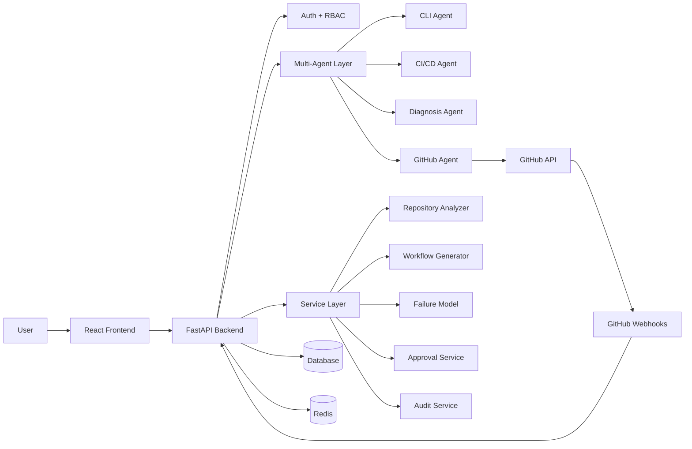

# Agentic AI-Powered Smart DevOps Assistant

**Agentic AI-Powered Smart DevOps Assistant for Autonomous Software Delivery and Infrastructure Management** is a supervisor-demo-ready CI/CD automation assistant.

The application helps a user scan a GitHub repository, detect its stack, generate GitHub Actions workflows, diagnose failed CI/CD logs with a trained ML model, recommend practical fixes, and propose safe pull requests with approval and audit controls.

The project is designed to demonstrate a controlled automation loop. It is not intended to make uncontrolled production changes.

## What This Project Proves

The MVP demonstrates this end-to-end flow:

1. A user logs in through the web app.
2. The user scans a GitHub repository or pastes CI/CD logs.
3. The backend detects project stack, package managers, existing workflows, and CI/CD readiness.
4. The system generates GitHub Actions workflow YAML for the detected stack.
5. Workflow changes are proposed through a branch and pull request.
6. GitHub webhook events can trigger diagnosis when workflow runs fail.
7. Real GitHub Actions logs are downloaded when credentials allow it.
8. A trained text classifier predicts the failure category and confidence.
9. A recommendation service suggests a practical fix.
10. Higher-risk actions wait for human approval.
11. Agent actions, GitHub actions, model predictions, approvals, and failures are audit logged.

## Main Features

- FastAPI backend with JWT authentication, httpOnly cookies, refresh sessions, and RBAC.
- React, Vite, TypeScript, Tailwind CSS, Radix UI, lucide-react, Zustand, and Axios frontend.
- Deterministic multi-agent routing with CI/CD, Diagnosis, GitHub, and CLI agents.
- Repository analysis for Node.js, React, Python, FastAPI, Java, Docker, monorepos, and existing GitHub Actions workflows.
- CI/CD readiness score with strengths, findings, warnings, and next actions.
- GitHub Actions workflow generation for common stacks.
- GitHub App installation support with PAT fallback for local MVP testing.
- GitHub webhook handling for installations and failed workflow runs.
- Real GitHub Actions log download and ML-based failure prediction.
- Selected safe fix PR creation through branch, commit, and pull request.
- Human-in-the-loop approval for high-risk automation.
- Execution history and audit logging for explainability.
- Optional Electron desktop shell and Capacitor Android package.

## Architecture At A Glance



The Orchestration Agent detects intent, selects exactly one specialized agent for the main task, and returns a structured result to the route layer. Existing route handlers stay thin and delegate business logic to agents or services.

## Technology Stack

Backend:

- FastAPI
- SQLAlchemy async ORM
- SQLite for local testing, PostgreSQL/Supabase-compatible PostgreSQL for deployment
- JWT auth with httpOnly browser cookies
- Pydantic schemas
- PyGithub and GitHub REST API
- scikit-learn, pandas, joblib
- Redis and Celery for background-capable architecture
- pytest, flake8, mypy

Frontend:

- React
- Vite
- TypeScript
- Tailwind CSS
- Radix UI primitives
- lucide-react icons
- Zustand stores
- Axios
- React Router

ML:

- TF-IDF text features
- Logistic Regression classifier
- joblib model and fix mapping artifacts
- CSV training datasets

Packaging:

- Docker Compose for local full-stack runs
- Electron for desktop packaging
- Capacitor for Android packaging

## Project Structure

```text
backend/app/
  agents/        Orchestration agent, specialized agents, and legacy DevOpsAgent
  api/routes/    FastAPI route modules
  core/          Config, database, security, logging, Celery
  ml/            Datasets, model artifacts, training script, reports
  models/        SQLAlchemy ORM models
  schemas/       Pydantic request/response contracts
  services/      Business logic and domain services
  tools/         GitHub, Docker, monitoring, and shell integrations

frontend/src/
  components/    Shared UI components and layout
  hooks/         WebSocket hooks
  lib/           RBAC and utility helpers
  pages/         Main application screens
  services/      API client layer
  store/         Zustand state stores
  types/         Shared TypeScript types

desktop/
  main.js        Electron shell
  preload.js     Isolated preload script
  package.json   electron-builder configuration

docs/
  Architecture, API, deployment, audit, demo, mobile, and GitHub E2E docs
```

## Quick Start

Prerequisites:

- Python 3.11 required. Python 3.13 is not supported for this MVP because pinned ML packages may fail to install.
- Node.js 18 or newer
- npm
- Git
- Docker Desktop only if you want the full Compose stack or Docker tool checks

Create local environment files from the safe templates. This command never overwrites existing `.env` files:

```bash
make init-env
```

Install dependencies. The backend virtualenv is created with Python 3.11:

```bash
make setup
```

For a normal web demo, start the backend and frontend in separate terminals:

```bash
make backend
make frontend
```

Open:

```text
Frontend: http://localhost:5173
Backend docs: http://localhost:8000/docs
Health check: http://localhost:8000/health
```

Default local admin values are defined in `backend/.env.example` for demo databases:

```text
Email: admin@example.com
Username: admin
Password: admin123
```

Change these before exposing the application outside a local demo.

## Docker Compose

Run the full local stack with PostgreSQL, Redis, backend, frontend, Celery worker, and Flower:

```bash
make init-env
make dev
```

Build and run the stack:

```bash
make init-env
make dev-build
```

Useful Compose commands:

```bash
make docker-logs
make docker-down
```

The frontend is exposed at `http://localhost:5173`, the backend at `http://localhost:8000`, and Flower at `http://localhost:5555`.

## Web, Desktop, And Mobile Modes

Web mode is the default. Login, JWT cookies, RBAC, role visibility, approvals, and audit logging remain enabled.

Desktop mode is for local single-user desktop demos. It opens as `Desktop User`, bypasses JWT/RBAC checks, hides Users & Roles and Sign out, keeps approval gates for risky actions, and records audit actions as `desktop_user`.

Desktop mode environment:

```bash
DESKTOP_MODE=true
DISABLE_AUTH=true
VITE_DESKTOP_MODE=true
VITE_API_BASE_URL=http://127.0.0.1:8000
```

Run desktop development mode:

```bash
make desktop-dev
```

Build the Windows desktop installer:

```powershell
Set-ExecutionPolicy -Scope Process Bypass
.\desktop\setup-windows.ps1
```

The installer is created under `desktop\dist`.

Mobile mode packages the React frontend with Capacitor. The backend still runs separately and must be reachable from the phone or emulator.

```bash
make mobile-sync
make mobile-open-android
make mobile-apk-debug
```

See [docs/MOBILE_APP.md](docs/MOBILE_APP.md) for LAN IP, ngrok, Android Studio, and APK troubleshooting.

## GitHub Integration

For real repository scans, workflow PRs, log downloads, and webhook diagnosis, configure either a GitHub App or a local PAT fallback in backend environment variables.

Recommended GitHub App permissions:

- Metadata: read
- Contents: read and write
- Pull requests: read and write
- Actions: read
- Workflows: read and write

Recommended webhook events:

- `workflow_run`
- `installation`
- `installation_repositories`

Webhook URL shape:

```text
https://your-public-backend/api/v1/webhooks/github
```

GitHub cannot call private `localhost` URLs. Use a public HTTPS tunnel for local webhook testing.

Do not put GitHub tokens, private keys, API keys, JWT secrets, or database passwords in frontend files or committed `.env` files.

## ML Model

The failure classifier lives under `backend/app/ml/`.

Runtime artifacts:

```text
backend/app/ml/failure_model.joblib
backend/app/ml/fix_mapping.joblib
```

Retrain the model:

```bash
make train-model
```

Prediction responses include at least:

- `label`
- `confidence`
- `suggested_fix`

Empty logs are handled gracefully, and prediction requests do not retrain the model.

## Quality And Build Commands

| Command | Purpose |
| --- | --- |
| `make init-env` | Create `backend/.env` and `frontend/.env` from examples without overwriting existing files. |
| `make setup` | Run `init-env`, then install backend and frontend dependencies. |
| `make backend` | Start FastAPI locally on `http://localhost:8000`. |
| `make frontend` | Start Vite locally on `http://localhost:5173`. |
| `make dev` | Start the full Docker Compose stack. |
| `make dev-build` | Build and start the full Docker Compose stack. |
| `make test` | Run backend and frontend tests where configured. |
| `make test-backend` | Run the backend pytest suite. |
| `make test-frontend` | Run frontend tests if configured. |
| `make lint` | Run configured backend and frontend lint/type checks. |
| `make format` | Run configured formatters. |
| `make build` | Build the frontend production bundle. |
| `make train-model` | Retrain the CI/CD failure classifier. |
| `make desktop-dev` | Run backend, Vite, and Electron in desktop mode. |
| `make desktop-check` | Verify desktop build prerequisites and secret hygiene. |
| `make mobile-check` | Verify mobile prerequisites and run a mobile build. |
| `make github-e2e-checklist` | Print a safe real-GitHub demo checklist. |
| `make prepare-submission-dry-run` | Preview clean submission ZIP contents. |
| `make prepare-submission` | Create a clean final submission ZIP. |
| `make clean` | Remove generated caches, builds, and local dependency installs. |

## Safety Principles

- Never push directly to `main` or `master`.
- GitHub repository changes must go through branch, commit, and pull request.
- High-risk actions require human approval.
- The system never auto-merges pull requests.
- Tokens, private keys, passwords, and secret-bearing environment values must not be logged or committed.
- Webhook signatures are verified when a webhook secret is configured.
- Frontend RBAC improves UX, but backend permission checks are the security boundary.
- Docker and CLI capabilities are optional local inspection features, not required for the core CI/CD workflow.

## Documentation

Start here:

- [Documentation Index](docs/README.md)
- [Startup Guide](STARTUP_GUIDE.md)
- [Architecture](docs/ARCHITECTURE.md)
- [Agent Design](docs/AGENT_DESIGN.md)
- [API Reference](docs/API_REFERENCE.md)
- [Deployment](docs/DEPLOYMENT.md)
- [Audit Logging](docs/AUDIT_LOGGING.md)
- [GitHub End-to-End Checklist](docs/GITHUB_E2E_CHECKLIST.md)
- [MVP Demo Guide](docs/MVP_DEMO.md)
- [Final Demo Guide](docs/FINAL_DEMO.md)
- [Mobile App Guide](docs/MOBILE_APP.md)
- [Desktop App Guide](desktop/README.md)
- [Contributing Guide](CONTRIBUTING.md)

## Current Scope

In scope for the MVP:

- CI/CD log diagnosis.
- Repository stack analysis.
- GitHub Actions workflow generation.
- GitHub workflow PR creation.
- GitHub webhook failure diagnosis.
- Selected safe fix PR creation.
- Human approval and audit history.
- Supervisor-ready frontend workflow.

Future expansion areas:

- AWS provisioning.
- Terraform automation.
- Kubernetes automation.
- Production-grade background scheduling.
- More failure categories and larger ML dataset.
- Broader automated fix generation.
