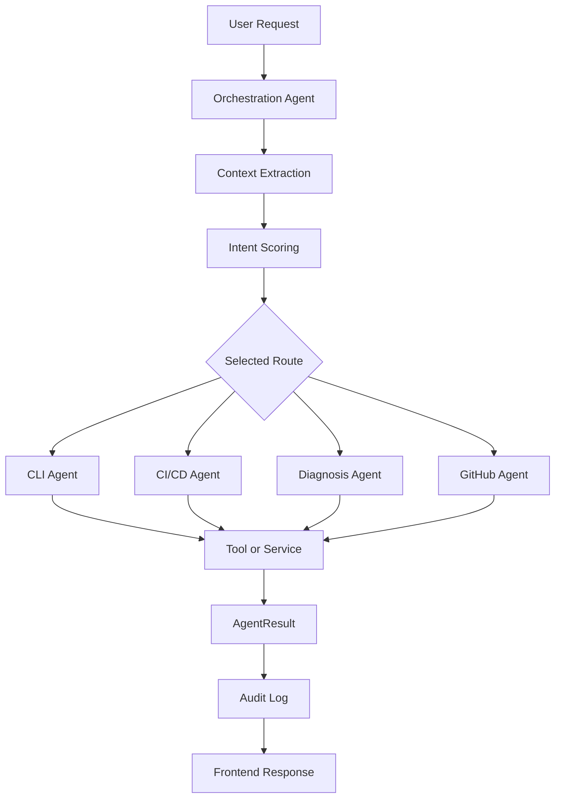

# Agent Design

This document explains the current agent design in the codebase.

The project has two agent paths:

1. **Deterministic multi-agent path** - the main supervisor-demo architecture.
2. **Legacy LangChain chat agent** - kept for compatibility with the existing chat UI.

The deterministic multi-agent path is the recommended architecture to explain in the final project demo.

## 1. Design Goal

The agent layer must make DevOps automation safer and easier to explain:

- no hidden direct production changes,
- one main specialized agent per request,
- deterministic routing where possible,
- existing services/tools reused instead of duplicated,
- high-risk work gated by approval,
- important decisions logged for audit.

## 2. Core Models

Location: `backend/app/agents/agent_types.py`

`AgentTask` carries the user request:

- `message`
- `user_id`
- `session_id`
- `context`

`AgentResult` returns structured output:

- `selected_agent`
- `intent`
- `risk_level`
- `success`
- `result`
- `metadata`

This stable shape makes the multi-agent UI and audit logs predictable.

## 3. Multi-Agent Flow

The Orchestration Agent selects exactly one specialized agent for the main task.

## 4. Orchestration Agent

Location: `backend/app/agents/orchestration_agent.py`

Responsibilities:

- normalize the incoming task,
- extract repository names from GitHub URLs or `owner/repo` text,
- extract workflow run IDs, workflow IDs, branch/ref values, container names, overwrite intent, and log text,
- score the request across CLI, CI/CD, Diagnosis, and GitHub routes,
- ask a specialized agent for an approval plan when the selected action is risky,
- delegate to the selected specialized agent,
- return the final `AgentResult`.

Routing examples:

| User request | Selected route |
| --- | --- |
| `generate workflow from these files` | CI/CD Agent |
| `analyze this log: npm ERR! Missing script test` | Diagnosis Agent |
| `scan repository owner/repo` | GitHub Agent |
| `create workflow PR for owner/repo` | GitHub Agent with approval plan |
| `show running containers` | CLI Agent |

## 5. CI/CD Agent

Location: `backend/app/agents/cicd_agent.py`

Purpose:

- analyze a provided file list,
- detect stack and project structure,
- generate GitHub Actions YAML when requested.

Inputs:

- `task.context["files"]`: list of repository file paths.

Services used:

- `repo_analyzer.detect_stack`
- `workflow_generator.generate_workflow`

Output metadata:

- detected stack,
- detected project count,
- warning count,
- generated workflow YAML when requested,
- workflow path.

Risk:

- Low, because it does not modify a real repository. It only analyzes and generates text.

## 6. Diagnosis Agent

Location: `backend/app/agents/diagnosis_agent.py`

Purpose:

- classify CI/CD logs,
- return confidence and suggested fix,
- enrich the result with practical fix recommendations.

Inputs:

- `task.context["log_text"]`, or
- a message that looks like a CI/CD error log.

Services used:

- `failure_prediction_service.predict_failure`
- `fix_recommendation_service.get_fix_recommendation`

Risk:

- Low, because it reads log text and returns analysis only.

## 7. GitHub Agent

Location: `backend/app/agents/github_agent.py`

Purpose:

- scan GitHub repositories,
- create generated workflow PRs,
- list workflows,
- list recent workflow runs,
- check workflow run status,
- download workflow logs,
- diagnose workflow runs,
- create selected fix PRs.

Tools/services used:

- `github_tool.py`
- `repo_analyzer.py`
- `failure_prediction_service.py`
- `fix_recommendation_service.py`
- `fix_pr_service.py`

Safety behavior:

- repository modifications are branch + commit + pull request,
- workflow PR, fix PR, and workflow trigger actions can create approval plans,
- no direct push to `main` or `master`,
- errors are returned as safe structured failures.

## 8. CLI Agent

Location: `backend/app/agents/cli_agent.py`

Purpose:

- optional local runtime inspection for the demo environment.

Current supported actions:

- list local containers,
- read logs from a named local container.

Why it exists:

- The project title includes infrastructure management.
- It allows a demo operator to inspect whether local services are running.
- It is not required for GitHub Actions generation or failure diagnosis.

Risk:

- Low in the specialized CLI Agent because it only calls read-only Docker inspection operations.

Important note:

The broader tool registry contains other Docker and shell tools for the legacy chat agent, but high-risk versions are role controlled and human-approval gated.

## 9. Legacy DevOps Agent

Location: `backend/app/agents/devops_agent.py`

This is the older LangChain-based chat agent. It remains available for the `ChatPage` and `/api/v1/agent/chat`.

It uses:

- LLM provider configuration,
- conversation memory,
- role-filtered tool registry,
- HITL exception handling for risky tools.

The deterministic multi-agent route should be preferred for demos because it is easier to explain, test, and audit.

## 10. Tool Registry

Location: `backend/app/agents/tools_registry.py`

The registry creates role-filtered LangChain tools for the legacy chat path.

Role behavior:

- viewer: read-only tools,
- developer: read-only plus lower-risk development tools,
- operator/admin: elevated tools with human approval where needed,
- admin: all backend permissions through RBAC.

High-risk wrappers raise `HITLApprovalRequired` instead of executing immediately when HITL is enabled.

## 11. Approval Planning

The deterministic Orchestration Agent asks the selected specialized agent whether the request needs approval before execution.

Examples:

| Action | Risk | Approval behavior |
| --- | --- | --- |
| Generate workflow YAML locally | Low | No approval. |
| Diagnose pasted CI/CD log | Low | No approval. |
| Scan repository | Low | No approval. |
| Create workflow PR | Medium | Approval plan in multi-agent route. |
| Create fix PR | Medium | Approval/service gate. |
| Trigger workflow | Medium/High | Approval plan. |

## 12. Audit Logging

The multi-agent route logs:

- message,
- context summary,
- selected agent,
- intent,
- risk level,
- success/failure,
- result summary,
- metadata summary,
- actor and session.

This gives the supervisor a visible explanation chain without exposing secrets.

## 13. Extending The Agent Layer

To add a new specialized agent:

1. Add the agent class under `backend/app/agents/`.
2. Reuse existing services or create a focused service under `backend/app/services/`.
3. Add deterministic routing terms to `OrchestrationAgent._scores`.
4. Add context extraction only if required.
5. Return `AgentResult`.
6. Add approval planning for write or high-risk actions.
7. Add tests for route selection and agent output.

Do not add LLM-only decision making for high-risk operations. Use deterministic checks and approval gates.
