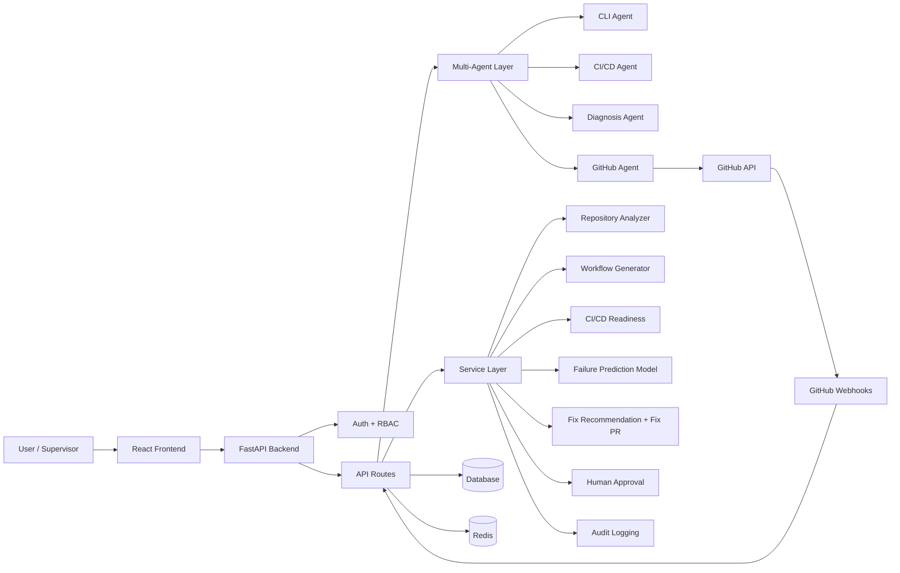
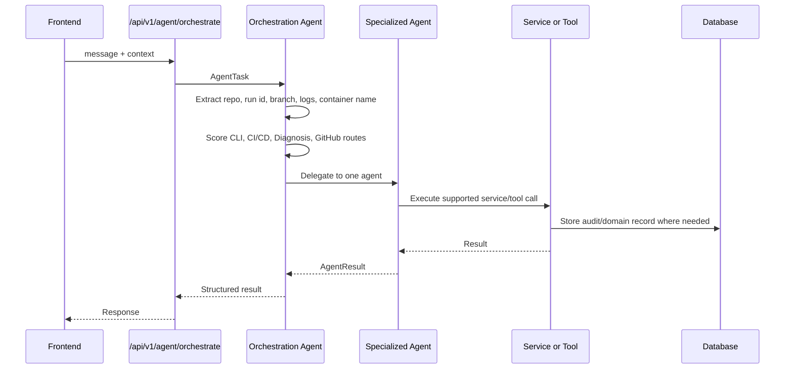
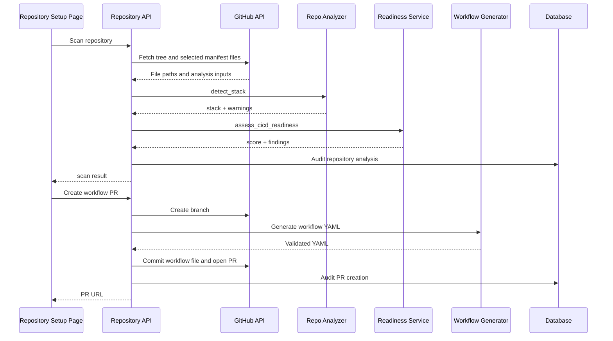
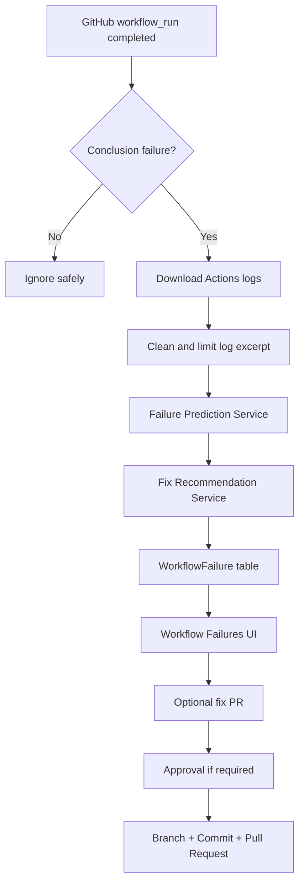
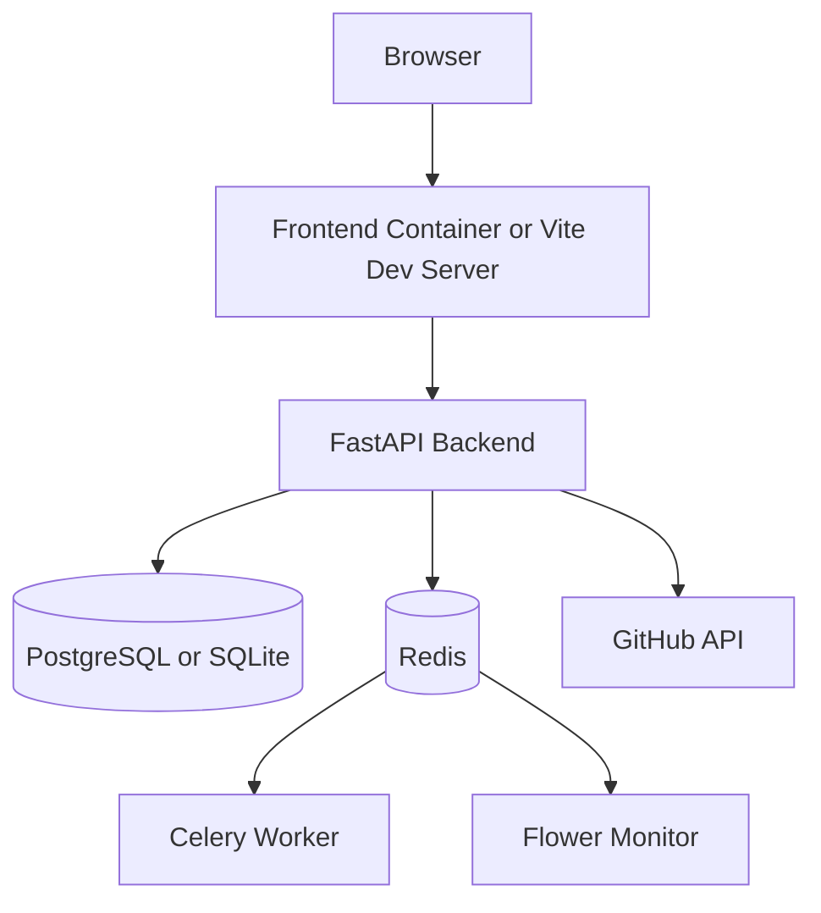

# System Architecture

This document describes the current architecture of the Smart DevOps Assistant. It is written from the live codebase, not from the original proposal.

## 1. Purpose

The system is a CI/CD automation assistant with safety controls. Its main job is to help a user:

- inspect a repository,
- detect the stack and CI/CD readiness,
- generate GitHub Actions workflow YAML,
- create workflow pull requests safely,
- diagnose failed CI/CD logs,
- recommend fixes,
- create selected fix pull requests,
- require human approval for risky actions,
- keep an audit trail.

Docker and shell capabilities exist only as optional local infrastructure inspection tools. They are not required for the core GitHub CI/CD workflow.

## 2. High-Level View

## 3. Frontend Architecture

Location: `frontend/src/`

The frontend is a React + Vite + TypeScript application. It provides the demo and operator interface for the system.

Main screens:

| Page | Purpose |
| --- | --- |
| `LoginPage.tsx` | User login and session creation. |
| `DashboardPage.tsx` | Overview screen for demo status and navigation. |
| `ChatPage.tsx` | Legacy chat agent interface. |
| `MultiAgentPage.tsx` | Deterministic multi-agent supervisor demo. |
| `DiagnosisPage.tsx` | Paste CI/CD logs and receive failure prediction. |
| `RepositorySetupPage.tsx` | Scan GitHub repo, view readiness, create workflow PR. |
| `WorkflowFailuresPage.tsx` | View failed GitHub Actions diagnoses and create fix PRs. |
| `ApprovalsPage.tsx` | Review and decide pending human approvals. |
| `ExecutionsPage.tsx` | Audit trail and execution history. |
| `EvaluationPage.tsx` | Project evaluation metrics and presentation support. |
| `SettingsPage.tsx` | Runtime settings such as API base URL for packaged clients. |
| `UsersPage.tsx` | Admin user management. |

Important frontend modules:

- `services/api.ts`: centralized Axios API client.
- `store/authStore.ts`: user session and authentication state.
- `store/chatStore.ts`: chat session state.
- `store/themeStore.ts`: theme state.
- `lib/rbac.ts`: frontend role visibility helpers.
- `components/layout/Layout.tsx`: authenticated app shell and navigation.

The frontend does not store GitHub tokens. Repository access is handled by the backend.

## 4. Backend API Architecture

Location: `backend/app/`

The backend is a FastAPI application with route modules organized by domain.

| Route module | Prefix | Responsibility |
| --- | --- | --- |
| `health.py` | `/health` | Health checks. |
| `auth.py` | `/api/v1/auth` | Login, register, refresh, logout, users, roles. |
| `agent.py` | `/api/v1/agent` | Legacy chat, multi-agent orchestration, WebSocket chat. |
| `cicd.py` | `/api/v1/cicd` | Offline file-list analysis and workflow YAML generation. |
| `repositories.py` | `/api/v1/repositories` | GitHub repo scan, installed repos, workflow PR creation. |
| `model.py` | `/api/v1/model` | CI/CD failure prediction. |
| `webhooks.py` | `/api/v1/webhooks` | GitHub App and workflow-run webhook events. |
| `workflow_failures.py` | `/api/v1/workflow-failures` | Stored workflow failure diagnoses and fix PR creation. |
| `approvals.py` | `/api/v1/approvals` | Human approval queue and decisions. |
| `executions.py` | `/api/v1/executions`, `/api/v1/audit` | Execution and audit history. |

Routes are intentionally thin. They validate requests, enforce RBAC, call services or agents, and return Pydantic response models.

## 5. Multi-Agent Architecture

Location: `backend/app/agents/`

The multi-agent path is deterministic. The Orchestration Agent receives a task, scores possible intents, extracts context, selects one specialized agent, and returns an `AgentResult`.

Agents:

- `OrchestrationAgent`: deterministic routing and context extraction.
- `CICDAgent`: stack detection and offline GitHub Actions YAML generation.
- `DiagnosisAgent`: CI/CD failure log classification and recommendation.
- `GitHubAgent`: GitHub repository scan, workflow actions, log download, fix PR path.
- `CLIAgent`: optional safe local container inspection, currently list containers and read logs.
- `DevOpsAgent`: legacy LangChain chat agent kept for compatibility.

## 6. Service Layer

Location: `backend/app/services/`

Services contain business logic:

| Service | Responsibility |
| --- | --- |
| `repo_analyzer.py` | Detect stack, framework, package manager, project directories, existing workflows, CI warnings. |
| `workflow_generator.py` | Generate GitHub Actions YAML for Node, Python, Java, Docker, generic, and multi-project repos. |
| `cicd_readiness_service.py` | Score CI/CD readiness and produce strengths, findings, and next actions. |
| `failure_prediction_service.py` | Lazy-load model artifacts and predict failure label, confidence, suggested fix. |
| `fix_recommendation_service.py` | Build practical fix recommendations from predicted label and repo context. |
| `workflow_failure_service.py` | Store and list GitHub Actions failure diagnosis records. |
| `fix_pr_service.py` | Create selected safe fix PRs or pending approval records. |
| `github_app_service.py` | GitHub App JWT, installation tokens, installed repo records, webhook signature verification. |
| `hitl_service.py` | Approval request helpers. |
| `audit_service.py` | Execution/audit records with sensitive value redaction. |
| `memory_service.py` | Persistent chat history abstraction. |
| `execution_service.py` | Execution lifecycle helpers. |
| `ws_manager.py` | WebSocket connection management helper. |

## 7. Tool Layer

Location: `backend/app/tools/`

Tools isolate integrations:

| Tool | Responsibility |
| --- | --- |
| `github_tool.py` | Repository tree, analysis snapshots, logs, workflows, branches, files, pull requests. |
| `docker_tool.py` | Optional local container inspection and controlled container operations. |
| `monitoring_tool.py` | Local process, metrics, and HTTP health checks. |
| `shell_tool.py` | Strict allowlisted shell command execution. |

The core CI/CD flow depends on GitHub tooling, not Docker.

## 8. Data Model

Location: `backend/app/models/models.py`

Main tables:

| Model | Purpose |
| --- | --- |
| `User` | User account with email, username, password hash, role, active flag. |
| `UserSession` | Refresh token session tracking. |
| `ChatMessage` | Persistent chat memory by session. |
| `ApprovalRequest` | Pending, approved, rejected, or timed-out human approval requests. |
| `Execution` | Audit history for API, agent, webhook, and approval actions. |
| `WorkflowFailure` | Stored diagnosis for failed GitHub Actions workflow runs. |
| `RepositoryInstallation` | GitHub App installation to repository mapping. |
| `AutomationRule` | Future automation policy model. |

## 9. CI/CD Repository Setup Flow

## 10. Failure Diagnosis Flow

## 11. Security And Safety

- Access tokens are accepted from Authorization bearer headers or the configured httpOnly cookie.
- Refresh tokens are stored in `user_sessions`.
- RBAC is enforced in backend route dependencies.
- Public self-signup is limited to viewer/developer accounts.
- Admin/operator accounts must be created by an admin.
- GitHub webhook signatures are verified when a webhook secret is configured.
- GitHub App installation tokens are preferred for installed repositories.
- PAT fallback exists for local MVP testing.
- GitHub modifications use pull requests, not direct pushes to protected branches.
- High-risk or medium-risk agent actions can create pending approval requests.
- Audit records redact known secret fields and truncate large values.

## 12. Deployment Topology

The project can run locally with SQLite or in a container topology with backend, frontend, PostgreSQL, Redis, Celery worker, and Flower. Electron desktop and Capacitor Android builds package the frontend experience, but both still depend on a reachable backend API.

## 13. Known Boundaries

The project currently focuses on GitHub CI/CD automation. AWS, Terraform, Kubernetes, Prometheus production monitoring, and fully autonomous remediation are future extensions unless specifically requested.
