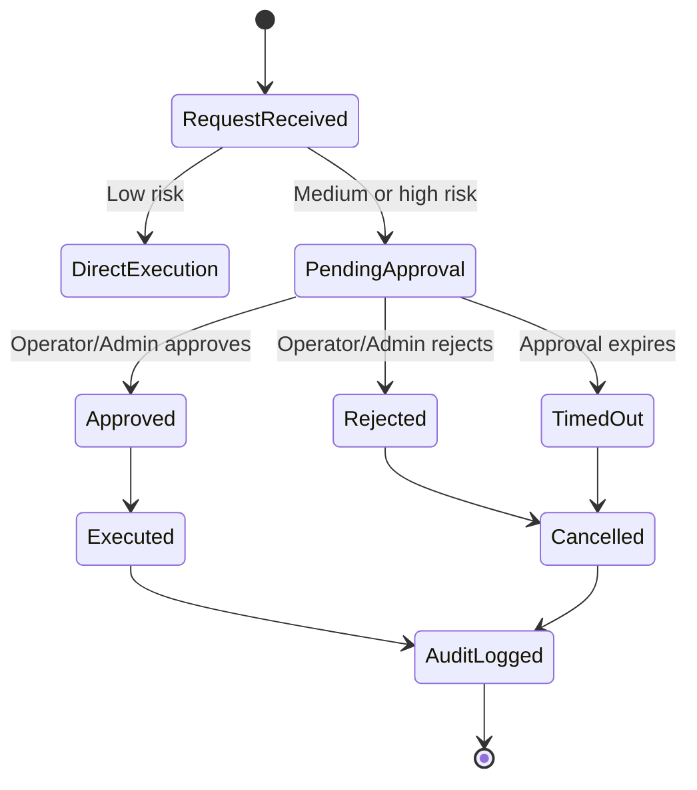

# Audit Logging And Safety Controls

This document explains how the project records important actions and protects risky automation.

## 1. Goals

Audit logging exists to make the system explainable:

- who requested an action,
- what tool/service was used,
- which agent selected the action,
- whether it succeeded,
- what error occurred,
- whether approval was required,
- which GitHub or model operation ran,
- when the action started and completed.

The audit trail is also useful for the final-year evaluation because it proves that the automation loop is visible and reviewable.

## 2. Main Tables

### `executions`

Primary audit trail for API, agent, webhook, and approval actions.

Important fields:

- `id`
- `session_id`
- `requested_by`
- `tool_name`
- `tool_input`
- `status`
- `summary`
- `details`
- `source`
- `approval_id`
- `started_at`
- `completed_at`

Typical statuses:

- `pending`
- `running`
- `completed`
- `failed`
- `cancelled`

Typical sources:

- `api`
- `agent`
- `webhook`
- `hitl`
- `system`

### `approval_requests`

Human approval records for high-risk or medium-risk actions.

Important fields:

- `requested_by`
- `tool_name`
- `tool_input`
- `action`
- `risk_level`
- `summary`
- `status`
- `payload`
- `decided_by`
- `decision_note`
- `expires_at`

Typical statuses:

- `pending`
- `approved`
- `rejected`
- `timed_out`

### `workflow_failures`

Domain-specific records for failed GitHub Actions diagnoses.

Important fields:

- `repo_full_name`
- `workflow_run_id`
- `workflow_name`
- `branch`
- `conclusion`
- `workflow_url`
- `log_excerpt`
- `predicted_label`
- `confidence`
- `suggested_fix`
- `recommendation_json`
- `fix_pr_url`
- `status`

## 3. Audit Service

Location: `backend/app/services/audit_service.py`

The audit service provides focused logging helpers:

- `log_execution`
- `log_prediction`
- `log_repo_analysis`
- `log_workflow_generation`
- `log_log_download`
- `log_workflow_pr_creation`
- `log_fix_recommendation`
- `log_fix_pr_creation`
- `log_approval_decision`
- `log_multi_agent_execution`

The service redacts sensitive values and summarizes large payloads before storing them.

## 4. Events That Are Logged

| Event | Where logged |
| --- | --- |
| Multi-agent request | `log_multi_agent_execution` |
| Repository scan | `log_repo_analysis` |
| Workflow YAML generation | `log_workflow_generation` |
| Workflow PR creation | `log_workflow_pr_creation` |
| Failure prediction | `log_prediction` |
| Fix recommendation | `log_fix_recommendation` |
| GitHub log download | `log_log_download` |
| Fix PR creation | `log_fix_pr_creation` |
| Approval decision | `log_approval_decision` |
| Webhook failure diagnosis | `Execution` + `WorkflowFailure` |
| Auth register/login/logout/refresh | `Execution` records with `source=auth` |
| GitHub App installation changes | `Execution` records with `source=webhook` |

## 5. Sensitive Data Rules

Never store or print:

- passwords,
- JWTs,
- refresh tokens,
- GitHub tokens,
- private keys,
- API keys,
- full authorization headers,
- full secret-bearing environment variables.

Logs may store:

- repository full name,
- workflow run ID,
- workflow name,
- branch,
- high-level tool input,
- redacted or truncated payloads,
- short log excerpts.

## 6. Human Approval Flow

Examples that can require approval:

- create generated workflow PR,
- create fix PR,
- trigger GitHub workflow,
- stop/run containers in the legacy tool registry,
- other repository or infrastructure-changing actions.

Examples that normally do not require approval:

- scan repository,
- generate workflow YAML locally,
- diagnose pasted logs,
- list workflow failures,
- read execution history.

## 7. RBAC Relationship

Approval gates are not a replacement for RBAC.

The backend first checks whether the user has permission to call an endpoint. If the user is allowed and the action is risky, the system can still create an approval request before execution.

For example:

- A developer can diagnose logs.
- An operator/admin can create workflow PRs through protected endpoints.
- An operator/admin can decide approvals.
- Admin has all permissions.

## 8. GitHub Safety

All GitHub repository modifications must follow:

1. Create branch.
2. Commit intended file change.
3. Open pull request.
4. Wait for human review.

The system must not:

- push directly to `main` or `master`,
- force push,
- auto-merge pull requests,
- delete branches automatically,
- log GitHub tokens.
