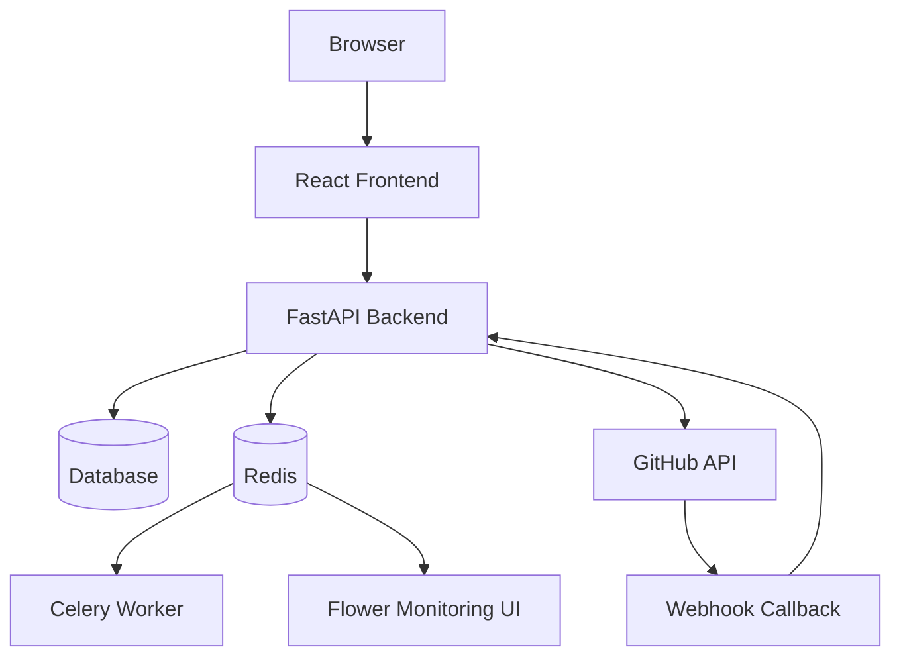

# Deployment Guide

This guide explains deployment architecture and environment requirements. It is not a production hardening checklist, but it documents how the project is intended to run for local demos and controlled deployments.

## 1. Deployment Modes

The project supports three practical modes:

| Mode | Use case | Database |
| --- | --- | --- |
| Local lightweight | Fast demo and development | SQLite |
| Local full stack | Demo with containers, Redis, worker, database | PostgreSQL through Docker Compose |
| Hosted backend/frontend | More realistic deployment | PostgreSQL or Supabase-compatible database |

The core CI/CD features do not require Docker. Docker Compose is only a convenient way to run the full app stack together.

## 2. Runtime Components



Required for the main MVP:

- backend,
- frontend,
- database,
- GitHub token or GitHub App credentials for real repository actions,
- trained model artifacts.

Optional:

- Redis,
- Celery worker,
- Flower,
- Docker socket for local container inspection.

## 3. Important Environment Variables

Backend:

| Variable | Purpose |
| --- | --- |
| `DATABASE_URL` | SQLAlchemy database URL. |
| `SECRET_KEY` | JWT signing secret. Must be strong outside local demo. |
| `ALLOWED_ORIGINS` | Comma-separated or JSON list of frontend origins. |
| `COOKIE_SECURE` | Should be true behind HTTPS. |
| `COOKIE_SAMESITE` | `lax`, `strict`, or `none`. |
| `REDIS_URL` | Redis URL for memory/task support. |
| `CELERY_BROKER_URL` | Celery broker URL. Falls back to Redis URL if configured by compose. |
| `CELERY_RESULT_BACKEND` | Celery result backend. |
| `GITHUB_TOKEN` | PAT fallback for local testing. |
| `GITHUB_APP_ID` | GitHub App ID for installation tokens. |
| `GITHUB_APP_PRIVATE_KEY` | GitHub App private key. |
| `GITHUB_APP_WEBHOOK_SECRET` | Secret used to verify GitHub App webhooks. |
| `GITHUB_WEBHOOK_SECRET` | Legacy/shared webhook secret fallback. |
| `FAILURE_MODEL_PATH` | Optional override for model artifact path. |
| `FIX_MAPPING_PATH` | Optional override for fix mapping path. |
| `ENABLE_HITL` | Enables human approval gates. |

Frontend:

| Variable | Purpose |
| --- | --- |
| `VITE_API_BASE_URL` | Backend base URL. |

## 4. GitHub App Requirements

For production-style repository access, use a GitHub App installation.

Recommended repository permissions:

- Metadata: read-only.
- Contents: read and write.
- Pull requests: read and write.
- Actions: read and write if workflow run actions are needed.
- Workflows: read and write for workflow file updates.

Recommended events:

- `workflow_run`
- `installation`
- `installation_repositories`

Webhook URL shape:

```text
https://your-backend-domain/api/v1/webhooks/github
```

Localhost is not publicly reachable by GitHub. For local webhook testing, expose the backend through a secure tunnel and use that public URL.

## 5. Database Notes

The app can auto-create tables through startup initialization for local/demo use.

Main tables:

- `users`
- `user_sessions`
- `chat_messages`
- `approval_requests`
- `executions`
- `workflow_failures`
- `repository_installations`
- `automation_rules`

For a production-like deployment, use proper database migrations and backups.

## 6. Security Checklist

Before any public deployment:

- Replace default admin credentials.
- Use a strong `SECRET_KEY`.
- Enable HTTPS.
- Set `COOKIE_SECURE=true`.
- Restrict `ALLOWED_ORIGINS`.
- Use GitHub App installation tokens instead of broad PATs.
- Store secrets in the deployment secret manager.
- Keep `ENABLE_HITL=true`.
- Do not mount Docker socket unless local infrastructure inspection is required.
- Review logs to confirm secrets are redacted.

## 7. Model Artifacts

The backend expects model artifacts under `backend/app/ml/` unless environment variables override them.

Required runtime artifacts:

- `failure_model.joblib`
- `fix_mapping.joblib`

If the artifacts are unavailable, prediction endpoints return service-unavailable style errors instead of silently guessing.

## 8. Scaling Notes

For a stronger deployment:

- run multiple backend workers behind a reverse proxy,
- use PostgreSQL instead of SQLite,
- use Redis-backed memory,
- move long-running GitHub log downloads to Celery,
- use object storage for larger log artifacts,
- monitor error rates and webhook delivery failures,
- add database migrations for schema changes.
