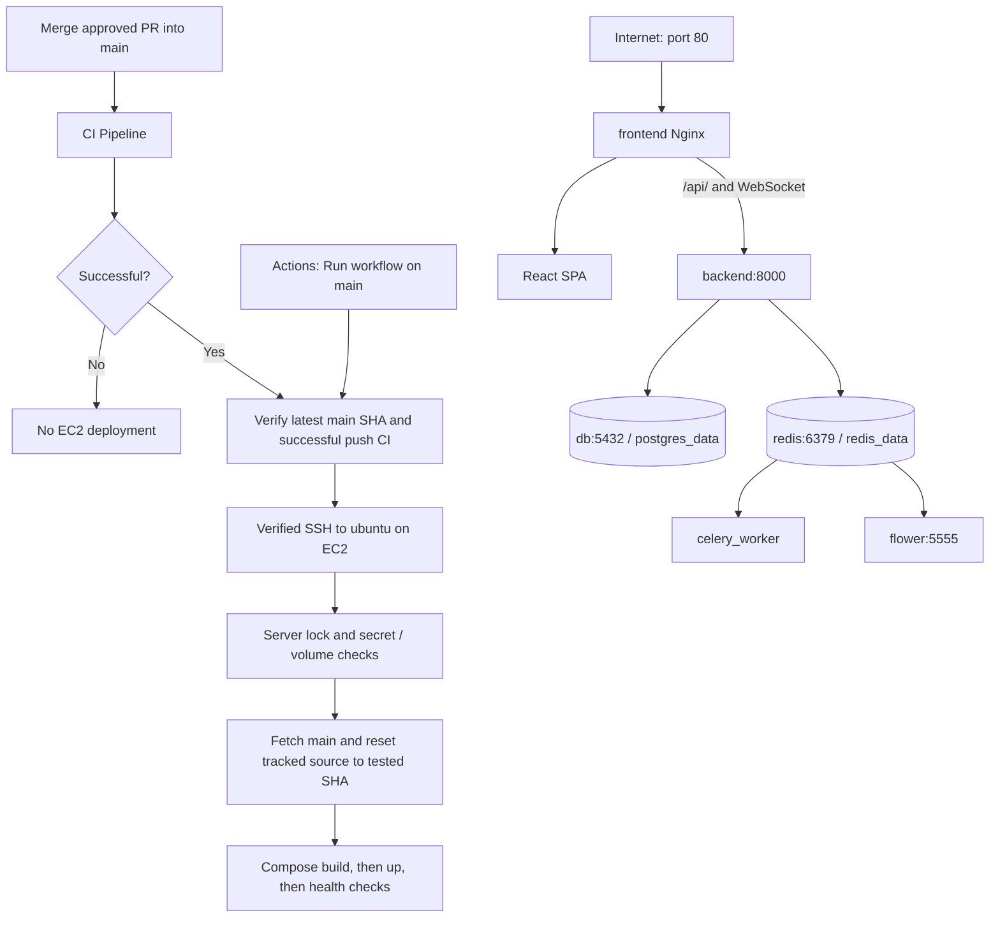

# Existing EC2 deployment: setup and operation

The repository changes implement SSH deployment to the existing Ubuntu server at
`3.27.37.180`. No production SSH session, source update, container restart, or
GitHub repository write was performed while implementing this change.

The existing app responded at `http://3.27.37.180:5173/` and its proxied health
endpoint during inspection on 2026-10-05. Port 80 was unreachable. After applying
this deployment, the public URL is `http://3.27.37.180/`.

## Architecture and CI gate



Only `frontend` publishes a host port: `80:80`. All six services keep their
existing Docker DNS service names and network, including `backend`, `db`, and
`celery_worker`. Container names become `agentic-frontend`, `agentic-backend`,
`agentic-postgres`, `agentic-redis`, `agentic-worker`, and `agentic-flower`.

`workflow_run` listens for **CI Pipeline** completed on main. The deploy job
requires a successful push run from this repository; PR, failed, cancelled,
develop, and fork runs cannot deploy. Manual runs must use main and also require
successful push CI for its latest revision. Stale automatic runs are explicitly
skipped. If main changes between the CI gate and EC2 fetch, deployment fails
before changing the checkout. A failed/skipped prerequisite is never replaced
with an untested newer commit. See [GitHub workflow events documentation](https://docs.github.com/en/actions/reference/workflows-and-actions/events-that-trigger-workflows#workflow_run).

GitHub concurrency uses `cancel-in-progress: false` to let an active SSH operation
finish. A nonblocking `flock` on EC2 prevents overlapping remote operations even
if a runner disconnects. The script builds before recreating services, refreshes
Nginx after backend recreation to resolve its new Docker IP, prints Compose
status, and retries both `http://localhost/` and
`http://localhost/api/v1/health`. A failed check fails the Action. Application
health checks prove frontend/backend reachability; they do not independently
test every worker task or database operation.

## Files inspected and changes

Initially inspected: `AGENTS.md`, `.github/workflows/ci.yml`,
`.github/workflows/deploy.yml`, `docker-compose.yml`, `backend/Dockerfile`,
`frontend/Dockerfile`, `frontend/nginx.conf`, `.gitignore`, `backend/.env.example`,
`frontend/.env.example`, both Docker ignore files, `Makefile`, frontend API,
runtime, settings and WebSocket code, Vite config, backend config/health code,
tracked ML artifact paths, README, and the existing deployment guide.

| Changed file | Exact purpose |
| --- | --- |
| `.github/workflows/deploy.yml` | Replace direct-push AWS/ECR deployment with CI-gated verified SSH. Require three secrets, validate them, check passing CI and latest SHA, serialize deployments, retain manual dispatch, and report health-checked success. |
| `scripts/deploy_ec2.sh` | Lock, fetch, check tested SHA, protect environment files before reset and check hashes afterwards, compare existing volume names, build/up services, refresh Nginx, health-check, and record successful/current previous SHA in `.git`. |
| `docker-compose.yml` | Publish only frontend port 80; use internal `expose` for other services; update container names; force HITL on and desktop/auth bypass off; use blank production API build URL. Keep service/network/volume names, ML mounts, and Docker integrations. |
| `frontend/nginx.conf` | Preserve SPA and `/api/` proxy; add forwarding protocol and WebSocket headers/timeouts; ensure API routes take precedence over static-file regex matching. |
| `frontend/Dockerfile` | Force authenticated web build flags, regardless of local desktop/mobile settings. Retain the existing multistage image. |
| `frontend/src/services/api.ts` | Default web API requests to the site's origin. Keep explicit environment/saved URL settings and desktop/mobile localhost fallback. |
| `frontend/src/pages/SettingsPage.tsx` | Update the explanatory API fallback text to match behavior. |
| `.github/workflows/ci.yml` | Build for same-origin; smoke-test frontend and proxied API on port 80 with retries; run new deployment safety, CI gate, and API default tests. Keep existing lint/test/build jobs. |
| `scripts/tests/test_deploy_ec2.py` | Ten tests using temporary Git repositories and fake Docker/HTTP tools, including secret preservation, ancestor-directory protection, revision/ignore/volume safeguards, build/health failure, lock contention, and rollback-marker recovery/redeploy. |
| `scripts/tests/test_deployment_workflow.mjs` | Seven tests execute the workflow's actual revision gate against mocked GitHub API responses. |
| `scripts/tests/test_frontend_api.mjs` | Five tests execute the API module for web, desktop, mobile, configured URL, and saved-setting reset behavior. |
| `README.md`, `docs/DEPLOYMENT.md` | Correct Compose URLs and link to the SSH deployment procedure. |
| `docs/EC2_DEPLOYMENT.md` | Setup, validation, first deployment, logs, troubleshooting, rollback, and final configuration snapshots. |

Unchanged: backend application code, backend Dockerfile, model artifacts,
authentication/RBAC/approval services, environment examples, and `.gitignore`.
The ignore rules already protect `.env`, backend/frontend `.env`, `.env.*`,
`*.pem`, and `*.key`, with only template examples tracked. Model files are copied
into the backend image by its existing `COPY . .`, and existing read-only ML
mounts are retained. Deployment does not train models.

## GitHub settings

Create exactly these **repository secrets**:

| Name | Value |
| --- | --- |
| `EC2_HOST` | `3.27.37.180` (host only, without scheme, port, or trailing slash) |
| `EC2_USER` | `ubuntu` |
| `EC2_SSH_KEY` | Entire dedicated OpenSSH private key generated below, including BEGIN/END lines |

UI: repository **Settings → Secrets and variables → Actions → Secrets → New
repository secret**. Repeat for each name. See [GitHub's secrets instructions](https://docs.github.com/en/actions/how-tos/write-workflows/choose-what-workflows-do/use-secrets).

Also create one **non-secret repository variable**, `EC2_KNOWN_HOSTS`, containing
the server's public SSH host identity obtained below. UI: the same Actions
settings page → **Variables → New repository variable**. This avoids trusting a
host key collected from an unauthenticated network scan. It is a public key,
not an additional credential. Missing secrets or this public identity fail the
deployment rather than falsely reporting success.

The built-in `GITHUB_TOKEN` reads CI status automatically. No user-created AWS,
ECR, registry, Docker Hub, or GitHub PAT secret is required by this workflow.
Application credentials remain in existing EC2 environment files. For a private
repository, EC2 itself still needs its existing read-only GitHub fetch access
(for example, a deploy key); the Actions-to-EC2 SSH key is a different key.

## One-time SSH and EC2 preparation

First disable the existing deployment workflow in **Actions → existing CD /
Deploy workflow → ⋯ → Disable workflow** while preparing and merging this
change. Keep CI enabled. This prevents a first deployment before the server is
ready. Merge via a reviewed PR; do not directly push repository changes to main.

On your Mac, generate a dedicated key. Use a different filename if it already
exists; do not overwrite an existing SSH key:

```bash
mkdir -p ~/.ssh
chmod 700 ~/.ssh
ssh-keygen -t ed25519 -N '' -C 'github-actions-agentic-ec2' -f ~/.ssh/agentic_actions
chmod 600 ~/.ssh/agentic_actions
```

Use your **existing trusted EC2 key** (replace `/path/to/existing-ec2.pem`) to
authorize only the new public key:

```bash
cat ~/.ssh/agentic_actions.pub | ssh -i /path/to/existing-ec2.pem ubuntu@3.27.37.180 'umask 077; mkdir -p ~/.ssh; cat >> ~/.ssh/authorized_keys; chmod 700 ~/.ssh; chmod 600 ~/.ssh/authorized_keys'
```

Connect with your existing trusted key and run these commands **on EC2**:

```bash
sudo apt-get update
sudo apt-get install -y git curl python3 util-linux
sudo usermod -aG docker ubuntu
docker compose version
awk '{ print "3.27.37.180 " $1 " " $2 }' /etc/ssh/ssh_host_ed25519_key.pub
```

Copy only that final public-key output into the `EC2_KNOWN_HOSTS` repository
variable. Reconnect so Docker group membership takes effect. The existing
deployment already needs Docker Engine and the Compose plugin; install/repair
them through the [official Ubuntu Docker instructions](https://docs.docker.com/engine/install/ubuntu/) only if `docker compose version` is unavailable.

On your Mac, test the new key and copy its private contents directly to your
clipboard for the `EC2_SSH_KEY` UI field, without printing them:

```bash
ssh -i ~/.ssh/agentic_actions -o IdentitiesOnly=yes ubuntu@3.27.37.180 'id -nG; docker compose version; docker info --format "{{.ServerVersion}}"; git -C ~/Autonomous-Infrastructure-Provisioning-and-Delivery-via-Agentic-AI ls-remote origin refs/heads/main'
pbcopy < ~/.ssh/agentic_actions
```

Keep the private key outside this repository. Never upload it as a repository
file. In EC2's security group, allow public HTTP TCP port 80 and allow SSH TCP
port 22 from the GitHub runner's reachable network. Hosted runners have changing
egress addresses; a security group that allows only your laptop cannot accept
their SSH connections. Verify any Ubuntu firewall permits the same traffic.
After successful migration, remove obsolete public rules for 5173, 8000, 5432,
6379, and 5555. The workflow does not modify security groups or firewalls.

## Validate EC2 before enabling automatic deployment

On EC2, before changing source, record the existing Compose project and attached
data volumes. These commands display only names/paths, not environment values:

```bash
cd ~/Autonomous-Infrastructure-Provisioning-and-Delivery-via-Agentic-AI
docker compose -f docker-compose.yml ps
for service in db redis; do
  container_id=$(docker compose -f docker-compose.yml ps -a -q "$service")
  if [ -n "$container_id" ]; then
    docker inspect --format '{{ index .Config.Labels "com.docker.compose.project" }} {{range .Mounts}}{{.Name}}:{{.Destination}} {{end}}' "$container_id"
  fi
done
git check-ignore .env backend/.env frontend/.env deployment.pem deployment.key
git ls-files --error-unmatch .env backend/.env frontend/.env
```

The last command should **fail** because none of these real env files are
tracked. Do not run that intentional check inside a shell with `set -e`.
Keep the original directory and Compose project name. Do not change
`COMPOSE_PROJECT_NAME`, `postgres_data`, or `redis_data`. If the deployment uses a
custom Compose project name, retain it in the ignored root `.env`. Deployment
explicitly selects `docker-compose.yml`, so an ignored local
`docker-compose.override.yml` does not silently publish extra ports or alter
production. Review any existing server overrides and move necessary settings
into the supported ignored environment configuration before enabling deployment.

Make a database backup before the first container migration:

```bash
backup_dir="$HOME/agentic-backups"
mkdir -p "$backup_dir"
chmod 700 "$backup_dir"
umask 077
docker compose -f docker-compose.yml exec -T db sh -c 'pg_dump -U "$POSTGRES_USER" -d "$POSTGRES_DB" --format=custom' > "$backup_dir/pre-ssh-deploy-$(date -u +%Y%m%dT%H%M%SZ).dump"
```

Preserve current database credentials and root/`backend/.env` values. Root `.env`
supplies Compose interpolation such as `POSTGRES_PASSWORD`/`DATABASE_URL`;
`backend/.env` supplies backend runtime settings. Values in `backend/.env` alone
do not supply Compose interpolation, and explicit Compose values override
`env_file`. Check that the effective connection points to the existing database.
Do not blindly replace an existing password: PostgreSQL's initialization
variables do not rotate a password in an existing volume. Configure your existing
strong signing key and admin credentials in place; never copy example credentials
over production files. Use `ENABLE_HITL=true`, `DISABLE_AUTH=false`, and
`DESKTOP_MODE=false` (also enforced by Compose), and `DEBUG=false` in production.
For this requested HTTP demo, keep the existing cookie policy compatible with
HTTP; set secure cookies when you add HTTPS. No authentication code is changed.

After the PR is merged and the **CI Pipeline push run for current main has
passed**, run these **on EC2**, with automatic deployment still disabled:

```bash
cd ~/Autonomous-Infrastructure-Provisioning-and-Delivery-via-Agentic-AI
test -f backend/.env
docker compose -f docker-compose.yml config --quiet
git fetch origin main
deploy_sha=$(git rev-parse origin/main)
git show "${deploy_sha}:scripts/deploy_ec2.sh" | bash -s -- "$deploy_sha"
docker compose -f docker-compose.yml ps
curl --fail --retry 12 --retry-all-errors --retry-delay 5 --retry-max-time 180 --max-time 10 http://localhost/
curl --fail --retry 12 --retry-all-errors --retry-delay 5 --retry-max-time 180 --max-time 10 http://localhost/api/v1/health
docker compose -f docker-compose.yml exec -T frontend nginx -t
docker compose -f docker-compose.yml exec -T db sh -c 'pg_isready -U "$POSTGRES_USER" -d "$POSTGRES_DB"'
docker compose -f docker-compose.yml exec -T redis redis-cli ping
```

This uses the reviewed script without resetting the checkout before its safety
checks. The script does not query GitHub CI itself; the manual operator must
confirm the successful current-main run as stated above. Avoid plain
`docker compose config` in shared logs because its expanded output contains
environment secrets; `config --quiet` validates without printing them.

From your Mac:

```bash
curl --fail http://3.27.37.180/
curl --fail http://3.27.37.180/api/v1/health
```

Log in, diagnose a sample failure, generate a workflow preview, and confirm chat
and approval visibility. If the browser previously saved a backend URL pointing
to localhost or port 8000, clear it using **Settings → Backend API URL → Reset** so the
same-origin default applies. Inspect browser Network requests: HTTP API and
WebSocket connections should use `3.27.37.180` on port 80.

## First automatic deployment and logs

1. Add the three secrets and public variable, complete the manual validation,
   and enable **Deploy to AWS EC2** in Actions.
2. Create a small reversible README change on a new branch:

   ```bash
   git switch -c test/ec2-auto-deployment
   # Make a small README change in your editor.
   git add README.md
   git commit -m "test deployment"
   git push -u origin test/ec2-auto-deployment
   ```

3. Open a PR, wait for its CI, review, and merge it. The merge creates the
   required main-branch push event without a direct push to main.
4. Wait for **CI Pipeline** on that main SHA to pass. Then **Deploy to AWS EC2**
   runs automatically. Confirm the checked-out SHA, Compose status, and success
   summary; failed CI must produce no EC2 execution.
5. Browse `http://3.27.37.180/`, log in, check the API health URL, and confirm
   preexisting data remains available.
6. On EC2, compare `git rev-parse HEAD` and
   `cat .git/ec2-deploy.current` to the successful CI SHA. Recheck PostgreSQL/Redis
   mount names against the names recorded before migration.

Manual deployment UI: **Actions → Deploy to AWS EC2 → Run workflow → Branch:
main → Run workflow**. The same CI gate applies; manual dispatch cannot bypass
failed, missing, or running CI.

Logs UI: **repository → Actions → Deploy to AWS EC2 → select run → deploy →
Deploy over verified SSH**. Also inspect **Select the latest main revision with
passing CI** and the workflow summary. With an already authenticated GitHub CLI:

```bash
gh run list --workflow deploy.yml
gh run view RUN_ID --log
gh run view RUN_ID --log-failed
```

## Diagnose SSH and Docker failures

SSH failures:

- **Missing setting:** check exact repository secret names and variable name.
  The private key must contain real newlines, with no passphrase, and its public
  key must be installed for `ubuntu`.
- **Timeout/refused:** verify current EC2 address, running instance, port 22,
  security-group source, routing, and host firewall. `EC2_HOST` must be a hostname
  or IPv4 address only; this workflow uses standard SSH port 22.
- **Permission denied (publickey):** run
  `ssh -v -i ~/.ssh/agentic_actions -o IdentitiesOnly=yes ubuntu@3.27.37.180`.
  Check `/home/ubuntu/.ssh` mode 700 and `authorized_keys` mode 600, ownership,
  and the matching public key. Do not paste a private key into logs or chat.
- **Host key verification failed:** compare the variable to the public host key
  through your existing trusted session. Update the public variable after a
  verified server replacement; do not disable host verification.
- **Docker socket permission denied:** reconnect after adding `ubuntu` to the
  Docker group. Confirm the Docker daemon and Compose plugin run.
- **Fetch denied:** test `git ls-remote origin refs/heads/main` as `ubuntu`; repair
  EC2's separate read-only GitHub access. Do not embed a token in the origin URL.
- **Server lock held:** check running processes with
  `pgrep -af 'deploy_ec2|docker compose|bash -s'`. Wait for the active deployment;
  removing the lock file does not safely release an active lock.

On EC2, investigate Docker failures with:

```bash
cd ~/Autonomous-Infrastructure-Provisioning-and-Delivery-via-Agentic-AI
docker compose -f docker-compose.yml config --quiet
docker compose -f docker-compose.yml ps -a
docker compose -f docker-compose.yml logs --tail=100 backend frontend db redis celery_worker flower
df -h
free -h
docker system df
sudo ss -ltnp 'sport = :80'
docker compose -f docker-compose.yml exec -T frontend nginx -t
```

Inspect logs privately and redact credentials before sharing. For a build
failure, run `docker compose -f docker-compose.yml build backend frontend`
interactively to find the failing layer; preserve the original running stack.
For a 502, check backend health and network membership, then refresh Nginx with
`docker compose -f docker-compose.yml up -d --no-deps --force-recreate frontend`.
For a persistent-volume-name refusal, reconcile the original Compose project and
volume names before retrying. Do not bypass the guard by deleting containers or
volumes. For port 80 conflicts, identify the owning process rather than blindly
stopping another service. Failed health checks leave the Action failed and do
not write a success marker; rollback is an operator action.

## Safe rollback

Disable **Deploy to AWS EC2** in the Actions UI and confirm no remote deployment
holds the lock. Choose a known-good revision from prior successful Actions runs
or `.git/ec2-deploy.previous`. After the first migration, prefer a known-good
revision that already uses port 80. Back up the database first as shown above.

For durable rollback, create a reviewed revert PR and merge it into main; its
successful CI deploys the reverted source without force-pushing. For an urgent
manual rollback to an already-reviewed revision, run this on EC2:

```bash
cd ~/Autonomous-Infrastructure-Provisioning-and-Delivery-via-Agentic-AI
git fetch origin main
rollback_sha=$(cat .git/ec2-deploy.previous)
git cat-file -e "${rollback_sha}^{commit}"
git diff --stat HEAD "$rollback_sha"
git ls-tree -r --name-only "$rollback_sha" -- .env backend/.env frontend/.env
git show "${rollback_sha}:.gitignore"
```

The protected env tree listing must be empty, and the reviewed target ignore
rules must still protect every existing env/key file. Inspect the target Compose
file before execution: keep the original database/Redis volume keys and project
name. Do not execute a reset for a revision that tracks any secret file or has
changed the data-volume names. Record the SHA currently running before rollback:

```bash
git rev-parse HEAD > .git/ec2-before-rollback
(
set -euo pipefail
git checkout -f main
git reset --hard "$rollback_sha"
docker compose -f docker-compose.yml config --quiet
docker compose -f docker-compose.yml build
docker compose -f docker-compose.yml up -d --remove-orphans
docker compose -f docker-compose.yml up -d --no-deps --force-recreate frontend
docker compose -f docker-compose.yml ps
curl --fail --retry 12 --retry-all-errors --retry-delay 5 --retry-max-time 180 --max-time 10 http://localhost/
curl --fail --retry 12 --retry-all-errors --retry-delay 5 --retry-max-time 180 --max-time 10 http://localhost/api/v1/health
printf '%s\n' "$rollback_sha" > .git/ec2-deploy.current
)
```

If the only rollback target is the original pre-migration configuration, its
frontend uses port 5173: run both curls against `http://localhost:5173/` instead,
and expect that public URL to be restored. Container names also revert, but
unchanged project/volume names retain the same data. Do not use
`docker compose down -v`, `git clean`, volume pruning, or database reset. Database
schema changes may require a separate migration strategy; this patch changes no
application schema and does not restore/overwrite data as part of rollback.
Merge a revert into main before re-enabling automatic deployment, otherwise the
next successful latest-main deployment reinstates the newer code.

## Data/secrets guarantees and local validation

Deployment uses no Compose down, Docker volume prune, database reset, model
training, registry push, or infrastructure provisioning. PostgreSQL's
`postgres_data` and Redis's `redis_data` definitions and mount destinations are
unchanged; attached volume names are checked before service recreation. Existing
named volumes are reused by Compose. See [Docker named-volume documentation](https://docs.docker.com/engine/storage/volumes/).

The existing CI Docker smoke-test teardown still removes only its disposable
GitHub runner volumes. That separate CI job never connects to EC2; the production
deployment workflow/script never runs that teardown or removes production volumes.

The script rejects tracked secret paths in either current or target Git tree,
checks current/target ignore rules before force checkout, hashes existing root,
backend and frontend env files, and verifies unchanged hashes afterwards.
It never prints their contents or runs `git clean`. Production `.env` files stay
on EC2 and are never committed, uploaded, or copied into Docker build contexts.
Local `make setup` created only ignored files from the tracked development
templates; these are separate from EC2's untouched production files.

Commands actually run locally:

```bash
make setup
make test-backend
make lint
make build
python3 -m unittest discover -s scripts/tests -v
node --test scripts/tests/test_deployment_workflow.mjs scripts/tests/test_frontend_api.mjs
docker compose config --quiet
actionlint .github/workflows/ci.yml .github/workflows/deploy.yml
shellcheck scripts/deploy_ec2.sh
bash -n scripts/deploy_ec2.sh
git diff --check
```

Results: 213 backend tests passed; backend/frontend lint and backend type checks
passed; frontend production build (including TypeScript) passed; ten deployment
safety tests and twelve JavaScript CI-gate/API-default tests passed. Compose
configuration, Actions YAML, shell lint, shell syntax, and diff whitespace
checks passed. Inspection of parsed Compose configuration confirmed that only
port 80 is published and auth bypass is off/HITL is on. No real env/key file is
tracked. Build warnings concerned bundle size and old Browserslist data; setup
reported existing dependency audit issues and a Capacitor CLI Node-engine
warning. No dependency manifests were changed to address unrelated issues.

A full Docker image build, `nginx -t` in a container, and production SSH rollout
were not run: the local Docker daemon was unavailable and no EC2 SSH credential
was supplied. The manual EC2 verification above is required before enabling the
automatic deployment. The public app remains on its current deployment until
these reviewed files reach main and you configure/enable deployment.

## Final configuration

The following snapshots show the exact final deployment workflow, Compose
changes, and final Nginx config. The source files remain authoritative.

### .github/workflows/deploy.yml

```yaml
name: Deploy to AWS EC2

on:
  workflow_run:
    workflows: ["CI Pipeline"]
    types: [completed]
    branches: [main]
  workflow_dispatch:

permissions:
  contents: read
  actions: read

# Cancelling a runner cannot reliably cancel its remote SSH process.
# Let active deployments finish; the EC2 script also takes a server-side lock.
concurrency:
  group: production-deployment
  cancel-in-progress: false

jobs:
  deploy:
    if: >-
      (github.event_name == 'workflow_dispatch' && github.ref == 'refs/heads/main') ||
      (github.event_name == 'workflow_run' &&
       github.event.workflow_run.conclusion == 'success' &&
       github.event.workflow_run.event == 'push' &&
       github.event.workflow_run.head_branch == 'main' &&
       github.event.workflow_run.head_repository.full_name == github.repository)
    runs-on: ubuntu-latest
    timeout-minutes: 45
    steps:
      - name: Select the latest main revision with passing CI
        id: revision
        uses: actions/github-script@v7
        with:
          script: |
            const repo = context.repo;
            const { data: branch } = await github.rest.repos.getBranch({ ...repo, branch: 'main' });
            const sha = branch.commit.sha;
            if (context.eventName === 'workflow_run' && context.payload.workflow_run.head_sha !== sha) {
              core.notice('Main has advanced; a later successful CI run must deploy it.');
              core.setOutput('ready', 'false');
              return;
            }
            const { data } = await github.rest.actions.listWorkflowRuns({
              ...repo, workflow_id: 'ci.yml', branch: 'main', event: 'push', head_sha: sha, per_page: 1
            });
            const run = data.workflow_runs[0];
            if (!run || run.status !== 'completed' || run.conclusion !== 'success') {
              core.setFailed('The latest main revision must have a successful CI Pipeline push run, including manual deployments.');
              return;
            }
            core.setOutput('sha', sha);
            core.setOutput('ready', 'true');

      - name: Check out the tested revision
        if: steps.revision.outputs.ready == 'true'
        uses: actions/checkout@v4
        with:
          ref: ${{ steps.revision.outputs.sha }}
          persist-credentials: false

      - name: Deploy over verified SSH
        if: steps.revision.outputs.ready == 'true'
        env:
          EC2_HOST: ${{ secrets.EC2_HOST }}
          EC2_USER: ${{ secrets.EC2_USER }}
          EC2_SSH_KEY: ${{ secrets.EC2_SSH_KEY }}
          # Public host identity, obtained through an already trusted EC2 session.
          EC2_KNOWN_HOSTS: ${{ vars.EC2_KNOWN_HOSTS }}
          DEPLOY_SHA: ${{ steps.revision.outputs.sha }}
        shell: bash
        run: |
          set -euo pipefail
          for name in EC2_HOST EC2_USER EC2_SSH_KEY EC2_KNOWN_HOSTS; do
            if [ -z "${!name}" ]; then
              echo "::error::Missing deployment setting: $name"
              exit 1
            fi
          done
          [[ "$EC2_HOST" =~ ^[a-zA-Z0-9][a-zA-Z0-9.-]*$ ]]
          [[ "$EC2_USER" =~ ^[a-zA-Z_][a-zA-Z0-9_-]*$ ]]
          [[ "$DEPLOY_SHA" =~ ^[0-9a-f]{40}$ ]]
          ssh_dir=$(mktemp -d)
          trap 'rm -rf "$ssh_dir"' EXIT
          chmod 700 "$ssh_dir"
          printf '%s\n' "$EC2_SSH_KEY" > "$ssh_dir/key"
          printf '%s\n' "$EC2_KNOWN_HOSTS" > "$ssh_dir/known_hosts"
          chmod 600 "$ssh_dir/key" "$ssh_dir/known_hosts"
          ssh -i "$ssh_dir/key" \
            -o BatchMode=yes -o IdentitiesOnly=yes -o StrictHostKeyChecking=yes \
            -o UserKnownHostsFile="$ssh_dir/known_hosts" -o ConnectTimeout=20 \
            -o ServerAliveInterval=30 -o ServerAliveCountMax=6 \
            "$EC2_USER@$EC2_HOST" "bash -s -- $DEPLOY_SHA" < scripts/deploy_ec2.sh

      - name: Deployment summary
        if: success() && steps.revision.outputs.ready == 'true'
        env:
          DEPLOY_SHA: ${{ steps.revision.outputs.sha }}
        run: echo "Deployed revision $DEPLOY_SHA; frontend and proxied API health checks passed." >> "$GITHUB_STEP_SUMMARY"
```

### docker-compose.yml changes

```diff
diff --git a/docker-compose.yml b/docker-compose.yml
index 42a08e7..b24f26e 100644
--- a/docker-compose.yml
+++ b/docker-compose.yml
@@ -8,13 +8,16 @@ x-backend-env: &backend-env
   REDIS_URL: redis://redis:6379/0
   CELERY_BROKER_URL: redis://redis:6379/0
   CELERY_RESULT_BACKEND: redis://redis:6379/0
+  ENABLE_HITL: "true"
+  DISABLE_AUTH: "false"
+  DESKTOP_MODE: "false"
 
 services:
 
   # ── Database ────────────────────────────────────────────────
   db:
     image: postgres:15-alpine
-    container_name: devops_assistant_db
+    container_name: agentic-postgres
     restart: unless-stopped
     environment:
       POSTGRES_USER: ${POSTGRES_USER:-devops_user}
@@ -22,8 +25,8 @@ services:
       POSTGRES_DB: ${POSTGRES_DB:-devops_assistant}
     volumes:
       - postgres_data:/var/lib/postgresql/data
-    ports:
-      - "5432:5432"
+    expose:
+      - "5432"
     healthcheck:
       test: ["CMD-SHELL", "pg_isready -U ${POSTGRES_USER:-devops_user}"]
       interval: 10s
@@ -35,11 +38,11 @@ services:
   # ── Redis ───────────────────────────────────────────────────
   redis:
     image: redis:7-alpine
-    container_name: devops_assistant_redis
+    container_name: agentic-redis
     restart: unless-stopped
     command: redis-server --appendonly yes
-    ports:
-      - "6379:6379"
+    expose:
+      - "6379"
     volumes:
       - redis_data:/data
     healthcheck:
@@ -55,14 +58,14 @@ services:
     build:
       context: ./backend
       dockerfile: Dockerfile
-    container_name: devops_assistant_backend
+    container_name: agentic-backend
     restart: unless-stopped
     env_file:
       - ./backend/.env
     environment:
       <<: *backend-env
-    ports:
-      - "8000:8000"
+    expose:
+      - "8000"
     volumes:
       - ./backend/app/ml:/app/app/ml:ro
       - /var/run/docker.sock:/var/run/docker.sock  # Docker tool integration
@@ -85,7 +88,7 @@ services:
     build:
       context: ./backend
       dockerfile: Dockerfile
-    container_name: devops_assistant_worker
+    container_name: agentic-worker
     restart: unless-stopped
     command: celery -A app.core.celery_app:celery_app worker --loglevel=info --concurrency=4
     env_file:
@@ -108,7 +111,7 @@ services:
     build:
       context: ./backend
       dockerfile: Dockerfile
-    container_name: devops_assistant_flower
+    container_name: agentic-flower
     restart: unless-stopped
     command: celery -A app.core.celery_app:celery_app flower --port=5555 --url-prefix=flower
     env_file:
@@ -116,8 +119,8 @@ services:
     environment:
       <<: *backend-env
       FLOWER_BASIC_AUTH: ${FLOWER_USER:-admin}:${FLOWER_PASSWORD:-admin}
-    ports:
-      - "5555:5555"
+    expose:
+      - "5555"
     depends_on:
       - redis
       - celery_worker
@@ -131,11 +134,12 @@ services:
       dockerfile: Dockerfile
       target: production
       args:
-        VITE_API_BASE_URL: ${VITE_API_BASE_URL:-}
-    container_name: devops_assistant_frontend
+        # This web deployment always uses Nginx's same-origin /api proxy.
+        VITE_API_BASE_URL: ""
+    container_name: agentic-frontend
     restart: unless-stopped
     ports:
-      - "5173:80"
+      - "80:80"
     depends_on:
       backend:
         condition: service_healthy
```

### frontend/nginx.conf

```nginx
map $http_upgrade $connection_upgrade {
    default upgrade;
    '' close;
}

server {
    listen 80;
    server_name _;
    root /usr/share/nginx/html;
    index index.html;

    # Gzip compression
    gzip on;
    gzip_types text/plain text/css application/json application/javascript text/xml application/xml text/javascript;
    gzip_min_length 1000;

    # SPA fallback — all routes serve index.html
    location / {
        try_files $uri $uri/ /index.html;
    }

    # API proxy (for containerized deployments)
    location ^~ /api/ {
        proxy_pass http://backend:8000/api/;
        proxy_set_header Host $host;
        proxy_set_header X-Real-IP $remote_addr;
        proxy_set_header X-Forwarded-For $proxy_add_x_forwarded_for;
        proxy_set_header X-Forwarded-Proto $scheme;
        proxy_http_version 1.1;
        proxy_set_header Upgrade $http_upgrade;
        proxy_set_header Connection $connection_upgrade;
        proxy_read_timeout 300s;
    }

    # Cache static assets
    location ~* \.(js|css|png|jpg|jpeg|gif|ico|svg|woff2)$ {
        expires 1y;
        add_header Cache-Control "public, immutable";
    }
}
```
