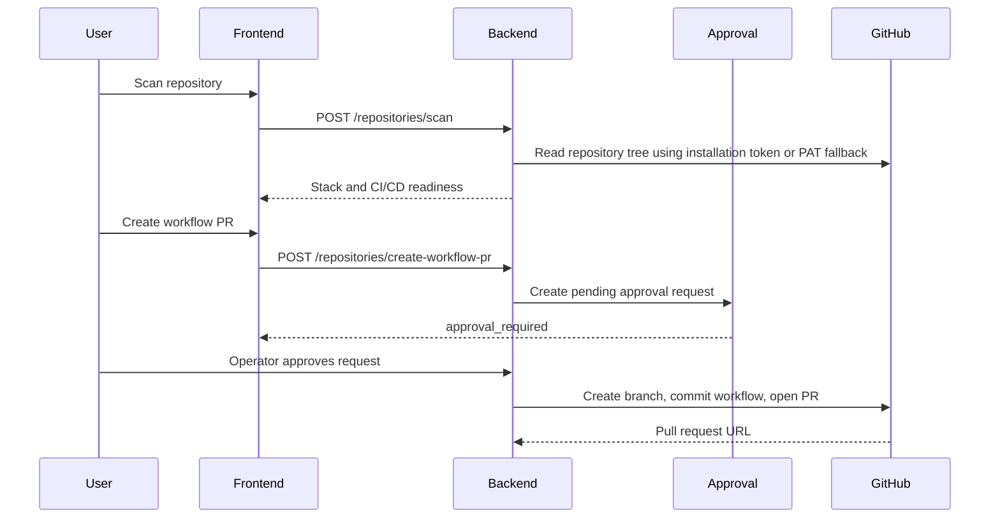

# GitHub End-to-End Checklist

This checklist verifies the real GitHub loop without pushing directly to a protected branch.

## Supported Flow

## Required GitHub App Permissions

Repository permissions:

| Permission | Access | Why |
| --- | --- | --- |
| Metadata | Read-only | Required by GitHub Apps. |
| Contents | Read and write | Read repository files and commit generated workflow/fix files. |
| Pull requests | Read and write | Open generated workflow and fix PRs. |
| Actions | Read and write | Read workflow runs and trigger workflows when approved. |
| Workflows | Read and write | Update files under `.github/workflows/`. |

Subscribe to these events:

- `workflow_run`
- `installation`
- `installation_repositories`

## Verification Steps

1. Install the GitHub App on a test repository.
2. Confirm the repository appears in `GET /api/v1/repositories/installed`.
3. Scan the repository from the Repository CI/CD Setup page.
4. Create a workflow PR from the frontend.
5. Confirm the response says approval is required.
6. Approve the request from the Approvals page using an operator/admin account.
7. Confirm GitHub receives a new `ai-cicd/setup-pipeline...` branch and a pull request.
8. Trigger a failing workflow run in the test repository.
9. Confirm the webhook stores a workflow failure and diagnosis.
10. Confirm the Executions page includes repository scan, approval, PR creation, log download, and prediction records.

## Expected Safety Behavior

- The system never commits directly to `main` or `master`.
- Workflow PR creation is approval-gated when `ENABLE_HITL=true`.
- Approval execution prefers a GitHub App installation token for installed repositories.
- PAT usage is only a local fallback through `GITHUB_TOKEN`.
- Failed AWS deployment configuration does not fail CI for repositories that have not configured AWS/EC2 secrets.
